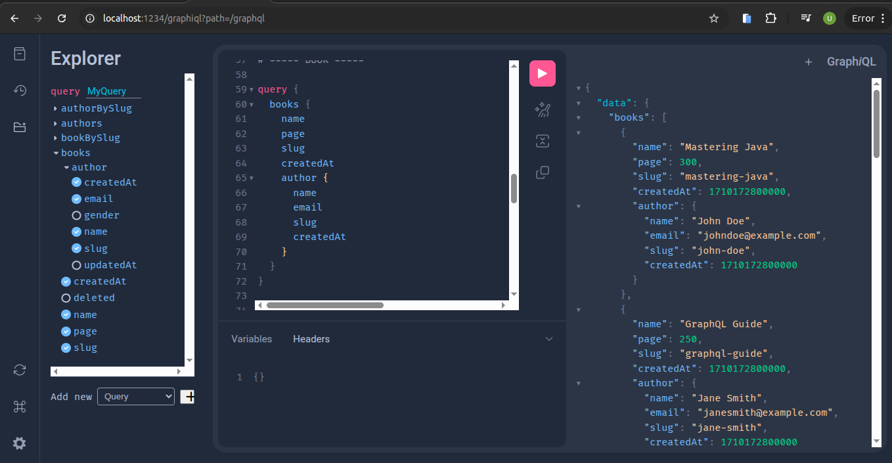

# 📚 GraphQL Book & Author API

## 📝 Deskripsi Proyek
Proyek ini adalah implementasi **CRUD Book dan Author** menggunakan **GraphQL** dengan **Spring Boot**. Database yang digunakan adalah **PostgreSQL** dan dikelola dengan **Flyway** untuk migrasi database. Selain itu, proyek ini juga mendukung **GraphQL Scalar** untuk menangani tipe data khusus.

## ✨ Fitur
- CRUD **Book** 📚
- CRUD **Author** ✍️

## 🛠️ Teknologi yang Digunakan
- **Java 21** ☕
- **Spring Boot** 🌱
- **GraphQL** API Endpoint 🌍
- **PostgreSQL** Database 🗄️
- **Flyway** Migration 🚀
- **GraphQL Scalars** Unix Data

## 📖 **GraphQL Scalar**
Proyek ini menggunakan **GraphQL Scalar** untuk menangani tipe data khusus seperti Unix Timestamp.  
**Dokumentasi resmi GraphQL Scalar:**  
🔗 [GraphQL Extended Scalars](https://github.com/graphql-java/graphql-java-extended-scalars)  

## 🚀 Cara Menjalankan Proyek
1. **Clone repository ini dalam folder**
   ```bash
   git clone https://github.com/WizziGameDev/graphql-project-book.git
   ```
2. **Jalankan PostgreSQL dan buat database**
   ```sql
   CREATE DATABASE learn;
   ```
4. **Konfigurasi `application.properties`**
   ```properties
   Sesuaikan konfigurasi yang diinginkan
   ```
5. **Migration**
   ``` cmd
   cd [name-project]
   mvn flyway:migrate -Dflyway.configFiles=src/main/resources/application.properties -X
   ```
7. **Jalankan aplikasi**

8. **Akses GraphQL Playground**
   Buka di browser:
   ```
   http://localhost:1234/graphiql?path=/graphql
   ```

## 📸 Tampilan
Tampilan cara menggunakan query GraphQL:



## 📌 Query & Mutation

### 🧑‍🎓 Author Queries & Mutations
#### 📌 Query: Ambil Semua Author
```graphql
query {
  authors {
    name
    email
    gender
    slug
    createdAt
    updatedAt
  }
}
```
#### 📌 Query: Ambil Author Berdasarkan Slug
```graphql
query {
  authorBySlug(slug: "john-doe") {
    name
    email
    gender
    slug
  }
}
```
#### ✍ Mutation: Tambah Author Baru
```graphql
mutation {
  createAuthor(request: {
    name: "Beri Open"
    slug: "beri-open"
    email: "beriopen@gmail.com"
    gender: "Female"
  }) {
    name
    slug
    email
    gender
    createdAt
  }
}
```
#### ✏ Mutation: Update Data Author
```graphql
mutation {
  updateAuthor(slug: "beri-open", request: {
    name: "Beri Delete"
    slug: "beri-delete"
    email: "beridelete@gmail.com"
    gender: "Male"
  }) {
    name
    slug
    email
    gender
    createdAt
  }
}
```
#### ❌ Mutation: Hapus Author
```graphql
mutation {
  deleteAuthor(slug: "beri-delete")
}
```

### 📖 Book Queries & Mutations
#### 📌 Query: Ambil Semua Buku
```graphql
query {
  books {
    name
    page
    slug
    createdAt
    author {
      name
      email
      slug
      createdAt
    }
  }
}
```
#### 📌 Query: Ambil Buku Berdasarkan Slug
```graphql
query {
  bookBySlug(slug: "book-four") {
    name
    page
    author{
      name
      slug
    }
  }
}
```
#### ✍ Mutation: Tambah Buku Baru
```graphql
mutation {
  createBook (author_slug: "charlie-white", request: {
    name: "Harry Potehhh"
    slug: "harry-potehhh"
    page: 100
  }) {
    name
    slug
    createdAt
    author {
      name
      slug
    }
  }
}
```
#### ✏ Mutation: Update Data Buku
```graphql
mutation {
  updateBook (author_slug: "charlie-white", book_slug: "harry-potehhh", request: {
    name: "Harry Poten"
    slug: "harry-poten"
    page: 40
  }) {
    name
    slug
    createdAt
    author {
      name
      slug
    }
  }
}
```
#### ❌ Mutation: Hapus Buku
```graphql
mutation {
  deleteBook(slug: "harry-poten")
}
```

🔥 **Happy Coding!** 🚀
